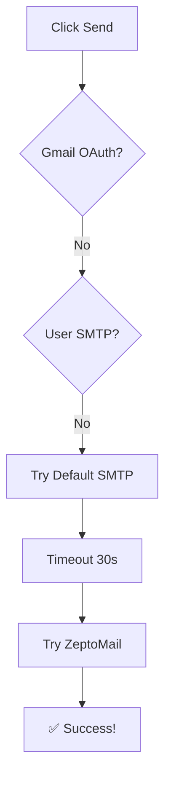

# ZeptoMail Local Testing Guide

## ✅ Setup Complete

### Configuration Added:
- **API Host:** `api.zeptomail.in`
- **Token:** `6f928e13f8568c7a`
- **Status:** Server running on http://localhost:3000

---

## 🧪 How to Test

### Step 1: Login to Your App
1. Open http://localhost:3000/login.html
2. Login with your account

### Step 2: Upload Resume (if not already done)
1. Go to http://localhost:3000/profile.html
2. Upload your resume PDF

### Step 3: Generate Cover Letter
1. Go to http://localhost:3000/review.html
2. Fill in:
   - Company Name: `Test Company`
   - Position: `Software Engineer`
   - Recipient Email: **your-test-email@gmail.com** (use your own email to verify)
3. Click "Generate Cover Letter"
4. Wait for AI generation to complete

### Step 4: Send Application
1. Click "Send Application" button
2. Watch the console logs

### Step 5: Verify in Console
Look for these messages in your terminal:

```
📧 Sending via ZeptoMail API...
   From: cv@cvapplyr.com
   To: your-test-email@gmail.com
   Subject: Application for Software Engineer - Your Name
✅ Email sent successfully via ZeptoMail
   Message ID: <message-id>
```

### Step 6: Check Your Email
1. Check your test email inbox
2. You should receive an email with:
   - Subject: `Application for Software Engineer - Your Name`
   - From: `cv@cvapplyr.com`
   - Attachments: Cover Letter PDF + Resume PDF

---

## 🔍 What to Look For

### Success Indicators:
- ✅ No SMTP timeout errors
- ✅ "Email sent successfully via ZeptoMail" message
- ✅ Email received in your inbox
- ✅ Both PDF attachments present
- ✅ Reply-To header correctly set

### If SMTP Still Tries First:
The app tries methods in order:
1. Gmail OAuth (if logged in with Google)
2. User's SMTP (if configured)
3. Default SMTP (will timeout - that's OK!)
4. **ZeptoMail API ← Should work here**

So you might see:
```
📧 Sending via default SMTP (.env)...
Default SMTP error: Connection timeout
SMTP Error Code: ETIMEDOUT
⚠️ SMTP failed, will try ZeptoMail API...
📧 Sending via ZeptoMail API...
✅ Email sent successfully via ZeptoMail
```

This is **EXPECTED and CORRECT** behavior!

---

## 📊 Expected Flow



---

## 🐛 Troubleshooting

### Error: "ZEPTOMAIL_TOKEN not configured"
**Check:**
```bash
grep ZEPTOMAIL_TOKEN .env
```
**Should show:**
```
ZEPTOMAIL_TOKEN=6f928e13f8568c7a
```

### Error: "ZeptoMail API error: Invalid token"
**Possible causes:**
1. Token typo in .env
2. Token expired/revoked in ZeptoMail dashboard
3. Domain not verified

**Solution:**
1. Verify token in .env matches: `6f928e13f8568c7a`
2. Check ZeptoMail dashboard for domain verification status

### Error: "Sender address not verified"
**Solution:**
- Ensure `cv@cvapplyr.com` domain is verified in ZeptoMail
- Check DNS records are properly configured

### Email Not Received
**Check:**
1. Spam folder
2. ZeptoMail dashboard → Reports → Email Logs
3. Terminal logs for actual error message

---

## 📝 Test Checklist

- [ ] Server started successfully (no syntax errors)
- [ ] Logged into app
- [ ] Resume uploaded
- [ ] Cover letter generated
- [ ] "Send Application" clicked
- [ ] Console shows "Sending via ZeptoMail API"
- [ ] Console shows "Email sent successfully"
- [ ] Email received in test inbox
- [ ] Cover letter PDF attached and readable
- [ ] Resume PDF attached and readable
- [ ] Reply-To header is correct (cv+username.date@cvapplyr.com)

---

## ✅ Once Verified

When everything works locally:

1. **Commit changes:**
```bash
git add -A
git commit -m "Fixed ZeptoMail integration with correct API endpoint and token"
```

2. **Add token to Railway:**
```bash
railway variables --set ZEPTOMAIL_TOKEN="6f928e13f8568c7a"
```

3. **Deploy to production:**
```bash
railway up --detach
```

4. **Test on production:**
   - Visit https://cvapplyr.com
   - Send test application
   - Verify email received

---

## 📞 Support

If issues persist:
- Check `server/services/zeptomailService.js` for implementation
- Check `server/controllers/emailController.js` line ~1090 for integration
- Review ZeptoMail docs: https://www.zoho.com/zeptomail/help/

---

## 🎉 Expected Result

After successful test, you'll have:
- ✅ Email sending working locally
- ✅ No SMTP port blocking issues
- ✅ Ready to deploy to production
- ✅ 10,000 free emails/month
